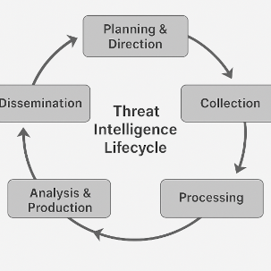

# Threat Intelligence Automation Framework

This repository features two modular, end-to-end solutions designed to operationalize threat intelligence workflows effectively:

1. **[Real-Time OSINT Dashboard](docs/real-time-threat-dashboard.md)** — Aggregates and visualizes real-time OSINT threat indicators using MISP, SQLite, Dash, and enrichment via VirusTotal and AbuseIPDB.

2. **[Unified Threat Feed Ingestion & TTP Mapping System](docs/unified-threat-feed-ingestion--ttp-mapping.md)** — Automates ingestion, normalization to STIX 2.1, MITRE ATT&CK-based enrichment, and structured reporting.

---

## Objectives

- Integrate structured and unstructured threat intelligence feeds from MISP.
- Enrich indicators with AbuseIPDB, VirusTotal, and MITRE ATT&CK.
- Normalize events to STIX 2.1 for interoperability.
- Visualize threat patterns and map IOCs to adversarial TTPs.
- Provide extensible pipelines for SOCs and researchers.

---
## Preliminary 

The **Threat Intelligence Lifecycle** is a structured process that organizations use to collect, analyze, and operationalize threat intelligence to enhance cybersecurity defenses. It ensures that raw data is transformed into actionable insights.

- **Planning & Direction**: Define intelligence goals.

- **Collection**: Gather data (e.g., MISP feeds).

- **Processing**: Normalize/filter data (STIX 2.1).

- **Analysis**: Map IOCs to TTPs (MITRE ATT&CK).

- **Dissemination**: Share via dashboards/reports.


    **Overviews of Threat Intelligence Lifecycle**                  

            

---

## 1️⃣ [Real-Time OSINT Dashboard](docs/real-time-threat-dashboard.md)

### Features
- Data Sources: [CIRCL MISP OSINT Feed](https://www.circl.lu/services/misp-feed-osint/)
- Enrichment: **VirusTotal API** (malware analysis) & **AbuseIPDB** (IP reputation)
- Storage: SQLite
- Visualization: Dash-based threat type distribution, geo-maps, time series

### Ideal For
- SOCs: Real-time monitoring.
- Researchers: Trend analysis.

---

## 2️⃣ [Unified Threat Feed Ingestion & TTP Mapping](docs/unified-threat-feed-ingetion--ttp-mapping.md)

### Features
- STIX 2.1 Conversion: Normalize MISP events.
- TTP Mapping: MITRE ATT&CK technique matching.
- Automation: Cron/systemd scheduling.

### Ideal For
- CTI Teams: Campaign analysis.
- Threat Hunters: IOC contextualization.

---

## System Requirements

- **Host Machine**: VirtualBox (with Ubuntu 20.04 or 22.04 as guest OS)
- **Dependencies (on Ubuntu Guest)**:
  ```bash
  sudo apt update && sudo apt install python3.10 python3.10-venv git docker.io -y
  python3.10 -m venv venv310
  source venv310/bin/activate
  ```

---

## Requirements:

Create a `requirements.txt` that includes:

```
pymisp==2.5.10
python-dotenv==1.1.0
requests==2.32.3
pandas==2.2.3
plotly==6.0.1
stix2==3.0.1
stix2-patterns==2.0.0
dash==3.0.2
dash-bootstrap-components==2.0.0
gunicorn==21.2.0
```

---
## Future Enhancements

| Priority  | Feature                          |
|-----------|----------------------------------|
| Near-term | ML-based IOC clustering          |
| Mid-term  | Shodan/WhoisXML API integration  |
| Long-term | D3.js correlation graphs         |


---

## Getting Help

Email: [Binod Vaidya](mailto:bvaidya@uottawa.ca)

[GitHub Repo](https://www.github.com/bnvaidya20/threat-intelligence-automation-framework)