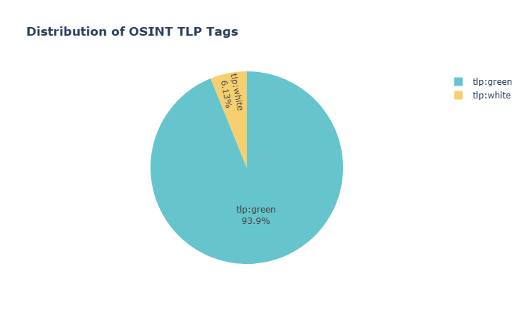

# Real-Time Threat Intelligence Dashboard for Cybersecurity Research
[Home](../README.md)

## Objective

Build a real-time threat intelligence dashboard that:
- Ingests OSINT indicators (IPs, domains, URLs, hashes) from the [CIRCL MISP OSINT Feed](https://www.circl.lu/services/misp-feed-osint/)
- Enriches threat data using AbuseIPDB and VirusTotal
- Stores and visualizes data using SQLite and Dash

---

## Workflow


---

### Phase 1: Setup MISP & CIRCL OSINT Feed Integration

#### Step 1.1: Deploy MISP Instance

Use [MISP Docker](https://github.com/MISP/misp-docker) to deploy:

```bash
git clone https://github.com/MISP/misp-docker.git
cd misp-docker
docker compose up -d
```

Access the MISP UI via `http://localhost`.

#### Step 1.2: Subscribe to CIRCL OSINT Feed

In MISP UI:
- Navigate to **Sync Actions > List Feeds**
- Enable and fetch the **CIRCL OSINT Feed**
- Ensure the feed is visible under **Event Actions > List Feeds**

#### Step 1.3: Automate Data Ingestion

Code Snippet: `fetch_misp_osint.py`

```python
def init_misp_connection(url, api_key, ssl=None):
    try:
        misp = PyMISP(url, api_key, ssl=verify_ssl)
        return misp
    except Exception as e:
        print(f"MISP connection failed: {str(e)}")
        return None
```

---

### Phase 2: Store & Process Threat Data

#### Step 2.1: SQLite Database Setup

##### Create Schema: `threat_schema.sql`

```sql
CREATE TABLE threats (
    id INTEGER PRIMARY KEY,
    type TEXT,
    value TEXT,
    timestamp TEXT,
    event_id TEXT,
    tag TEXT,
    description TEXT
    );
```

##### Initialize DB

```bash
sqlite3 misp_threats.db < threat_schema.sql
```

##### Insert Parsed Indicators

Code Snippet: `insert_threats.py`

```python
def process_misp_events(misp, conn):
    """Fetch and process events from MISP with proper attribute handling"""
    cursor = conn.cursor()
    
    events = misp.search(controller='events', tags=working_tags, limit=20)

    insert_count = 0
    for event in events:
        # Get the Event object (some versions nest it)
        event_data = event.get('Event', event)
        
        # Get attributes from correct location
        attributes = event_data.get('Attribute', [])
        if not attributes:
            print(f"Event {event_data.get('id')} has no attributes")
            continue
                    
        # Get tags for the event
        tags = ','.join(tag.get('name', '') for tag in event_data.get('Tag', []))
        
        for attribute in attributes:
            try:
                cursor.execute('''
                INSERT INTO threats (
                    type, value, timestamp, 
                    event_id, tag, description
                ) VALUES (?, ?, ?, ?, ?, ?)
                ''', (
                    attribute.get('type'),
                    attribute.get('value'),
                    attribute.get('timestamp'),
                    event_data.get('id'),
                    tags,
                    event_data.get('info', '')
                ))
                insert_count += 1
            except Exception as e:
                print(f"Error inserting attribute: {str(e)}")
                continue

    conn.commit()
    return insert_count
```

---

#### Step 2.2: Threat Indicator Enrichment

##### AbuseIPDB Enrichment: 
- Use AbuseIPDB (IP reputation)

Code Snippet: `enrich_with_abuseipdb.py`

```python
def enrich_with_abuseipdb(ip, api_key):
    """Enrichment with full data capture"""
    url = f"https://api.abuseipdb.com/api/v2/check?ipAddress={ip}"
    headers = {'Key': api_key, 'Accept': 'application/json'}
    
    try:
        response = requests.get(url, headers=headers)
        response.raise_for_status()
        data = response.json()['data']
        
        return {
            'score': data['abuseConfidenceScore'],
            'total_reports': data['totalReports'],
            'last_reported': data['lastReportedAt'],
            'isp': data['isp'],
            'country': data['countryCode']
        }
    except Exception as e:
        print(f"Error processing {ip}: {str(e)}")
        return None
```

##### VirusTotal Enrichment: 
- Use VirusTotal API (malware analysis)

Code Snippet: `enrich_with_virustotal.py`

```python
def enrich_with_virustotal(ioc_type, ioc_value):
    """Query VirusTotal with IOC (IP/domain/hash)"""
    endpoint = get_vt_endpoint(ioc_type, ioc_value)
    if not endpoint:
        print(f"Unsupported IOC type: {ioc_type}")
        return None

    url = VT_URL_BASE + endpoint
    headers = {"x-apikey": VT_API_KEY}
    
    try:
        response = requests.get(url, headers=headers)
        response.raise_for_status()
        return response.json()
    except requests.RequestException as e:
        print(f"VirusTotal error for {ioc_value}: {e}")
        return None
```

---

### Phase 3: Dissemination 

#### Step 3.1: Dashboard with Secure Dash Deployment

```bash
# Production deployment with gunicorn
gunicorn -b 0.0.0.0:8050 app:server --workers 4
```

#### Step 3.2: Scheduled Automation
```bash
# cron job (hourly)
0 * * * * /usr/bin/python3 /path/to/scripts/fetch_misp_osint.py >> /var/log/threat_fetch.log 2>&1
```
---

## Output Samples

| Threat Type Distribution | Top 10 Event Sources |
|--------------------------|----------------------|
|  |  |

| TLP tag Distribution | Top 10 domain Indicators |
|--------------------------|----------------------|
|  |  |

| Threat indicators over time | Top 10 Threat Distribution |
|--------------------------|----------------------|
|  |  |

| IOC type Distribution | AbuseIPDB score by country |
|--------------------------|----------------------|
|  |  |

**AbuseIPDB score by ISP**
 

---

## Best Practices

1. **Security Hardening**
   - Store sensitive credentials (API keys, DB paths) in `.env` files.
   - Set secure file permissions: `chmod 600 .env`.
   - Always enable HTTPS for MISP and Dash when deployed outside localhost.

2. **System Monitoring & Resilience**
   - Implement structured logging for all scheduled ingestion and enrichment tasks.
   - Monitor enrichment failures (AbuseIPDB, VirusTotal) and back-off intelligently.