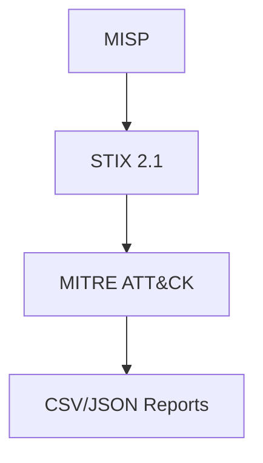

# Unified Threat Feed Ingestion & TTP Mapping System
[Home](../README.md)

A complete automated pipeline to:
- Ingest threat intelligence feeds (structured/unstructured)
- Normalize to STIX 2.1 format
- Enrich with MITRE ATT&CK context
- Map to Tactics, Techniques, and Procedures (TTPs)
- Generate structured CSV/JSON reports

---

## Pipeline Overview


---

## Step 1: Setup MISP in Docker

### Use MISP-Dockerized: [https://github.com/MISP/misp-docker](https://github.com/MISP/misp-docker)

```bash
git clone https://github.com/MISP/misp-docker.git
cd misp-docker
cp template.env .env
```

### Add your User to the Docker Group:

```bash
sudo usermod -aG docker $USER

newgrp docker
```
Then log out and back in, or run `newgrp docker` to refresh group membership.

### Start the Docker Environment:

Use Docker Compose to build and start all required services.

```bash
docker compose build

docker compose up -d
```


---

## Step 2: Prepare MISP Access

1. Navigate to `https://localhost` or `http://127.0.0.1:8080`
2. Obtain API key from the MISP Web UI under your user preferences.
3. Save your API key securely in a `.env` file:
   ```
   API_KEY=your_misp_api_key_here
   ```

---

## Step 3: Normalize Threat Events to STIX

Use `unified_ingest_normalize.py` to pull published MISP events and convert them to STIX indicators.

### Script Summary

- Connects to MISP
- Extracts attributes like IPs, hashes, domains, URLs
- Converts them to STIX `Indicator` objects


### Code Snippet

```bash
def init_misp_connection(url, api_key, ssl=False):
    try:
        return PyMISP(url, api_key, ssl=ssl)
    except Exception as e:
        raise ConnectionError(f"MISP connection failed: {str(e)}")


def normalize_to_stix(misp, limit=30):
    stix_objects = []
    events = misp.search(published=True, limit=limit)
    events = events.get('response', []) if isinstance(events, dict) else events

    for e in events:
        event = e.get('Event', e)
        for attr in event.get('Attribute', []):
            try:
                stix_pattern = map_attribute_to_pattern(attr)
                if stix_pattern:
                    stix_objects.append(Indicator(
                        name=attr['type'],
                        pattern=stix_pattern,
                        pattern_type="stix",
                        valid_from=datetime.datetime.utcnow()
                    ))
            except Exception as ex:
                print(f"Error processing attribute {attr}: {ex}")

    return stix_objects
```

---

## Step 4: Build MITRE ATT&CK Technique Map

Use `enrich_attack_techniques.py` to parse a local copy of the MITRE ATT&CK STIX dataset.

### Source File

Download from: [https://github.com/mitre/cti](https://github.com/mitre/cti)

```bash
wget https://raw.githubusercontent.com/mitre/cti/master/enterprise-attack/enterprise-attack.json
```

### Code Snippet

```bash
def extract_technique_map(attack_file):
    with open(attack_file, "r") as f:
        attack_data = parse(f.read(), allow_custom=True)
    techniques = [o for o in attack_data.objects if getattr(o, 'type', None) == 'attack-pattern']
    return {t.name.lower(): t.id for t in techniques}
```

---

## Step 5: Map IOCs to ATT&CK TTPs

Use `map_ioc_to_ttp_report.py` to:
- Parse the normalized STIX bundle
- Match indicator patterns against known ATT&CK techniques
- Generate structured reports

### Code Snippet

```bash
def map_iocs_to_ttps(bundle, technique_map):
    mappings = []
    for obj in bundle.objects:
        if isinstance(obj, Indicator):
            pattern = obj.pattern.lower()
            for name, tid in technique_map.items():
                if name in pattern:
                    mappings.append({
                        "ioc": obj.pattern,
                        "matched_technique": name,
                        "technique_id": tid
                    })
    return mappings

def save_mapping_report(mappings):
    pd.DataFrame(mappings).to_csv("data/ioc_ttp_mapping_report.csv", index=False)
    with open("data/ioc_ttp_mapping_report.json", "w") as f:
        json.dump(mappings, f, indent=4)
    print(f"Saved {len(mappings)} mappings to CSV and JSON")
```

---

## Step 6: Automate the process

A script `automate_threat_pipeline.py` is built for automation.
It shall sequentially execute:

`unified_ingest_normalize.py` to ingest and normalize MISP threat events.
> Output: `data/normalized_stix.json` (STIX Bundle of Indicators)


`enrich_attack_techniques.py` to parse MITRE ATT&CK techniques and save mapping.
> Output: `data/tech_map.pkl` (Pickled dict of technique names to ATT&CK IDs)


`map_ioc_to_ttp_report.py` to map IOCs to TTPs and generate structured reports in CSV and JSON.
> Outputs:
- `data/ioc_ttp_mapping_report.csv`
- `data/ioc_ttp_mapping_report.json`


### Code Snippet

```bash
def run_script(script_name):
    print(f"\n Running: {script_name}")
    try:
        result = subprocess.run([sys.executable, script_name], check=True)
        print(f" Completed: {script_name}\n")
    except subprocess.CalledProcessError as e:
        print(f" Failed: {script_name} with error code {e.returncode}")
        sys.exit(e.returncode)
```
        
### Code Execution 

```bash
python automate_threat_pipeline.py

```


---

## Sample Output

### JSON Report
```json
{
  "ioc": "[ipv4-addr:value = '192.168.1.5']",
  "matched_technique": "Command and Control",
  "technique_id": "T1071.001",
  "last_observed": "2023-11-20T12:00:00Z"
}
```


---

## Best Practices

1. **STIX Data Integrity & Validation**
   - Always validate STIX bundles using `stix2-validator` before mapping to TTPs.
   - Sanitize and pre-process MISP attributes to ensure syntactic STIX compliance.
   - Apply pattern transformation fallbacks for non-standard IOC types.

2. **Modular Automation & Extensibility**
   - Maintain modular scripts (`normalize`, `enrich`, `map`) to allow independent testing and debugging.
   - Parameterize file paths and limits (e.g., with argparse) to support flexible pipeline execution.
   - Design for compatibility with other enrichment sources like OpenCTI or ThreatBus.
